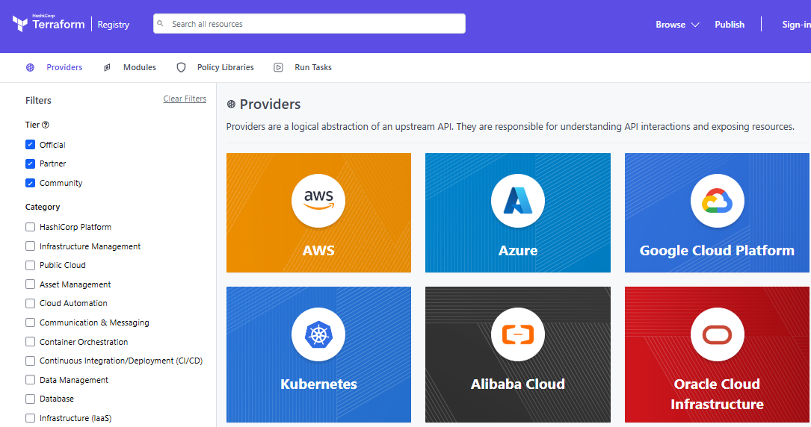

# Infraestrutura como Código com Terraform

IaC ou Infraestrutura como Código, é uma metodologia de gerenciamento e provisionamento de infraestrutura de TI através de código e automação, em vez de processos manuais. Isso significa que servidores, bancos de dados, redes e outros recursos de infraestrutura são configurados e gerenciados usando código e ferramentas de software.

A principal vantagem do IaC é a capacidade de automatizar a criação, configuração e gerenciamento de infraestrutura. Isso elimina a necessidade de intervenção manual, garantindo que a infraestrutura seja consistente, reproduzível e escalável.

Em vez de configurar manualmente a infraestrutura ou usar scripts ad-hoc, o IaC utiliza arquivos de configuração descritiva. Estes arquivos, muitas vezes escritos em linguagens como `YAML` ou `JSON`, descrevem o estado desejado da infraestrutura. Ferramentas como `Terraform`, `Ansible` e `Chef`, então, interpretam esses arquivos e fazem as alterações necessárias para alcançar esse estado.

---

## Terraform

`Terraform` é uma plataforma de gerenciamento de infraestrutura como código (IAC) desenvolvida pela Hashcorp. A plataforma permite que você descreva a infraestrutura de TI como código e use essa descrição para criar, alterar e gerenciar a infraestrutura de forma automatizada.

Com Terraform, você pode escrever código em sua linguagem de programação favorita para descrever sua infraestrutura em termos de recursos, como servidores, redes e volumes de armazenamento. Terraform usa essa descrição para criar e gerenciar esses recursos em vários provedores de nuvem, como AWS, Azure, GCP e outros.

Uma das principais vantagens do Terraform é que ele `permite que você gerencie sua infraestrutura de forma abstrata`, independentemente do provedor de nuvem específico.

---

## Comandos do Terraform

* Iniciando o terraform

```hcl
terraform init
```

* Checagem da infra a ser criada (exibe o plano de execução):

```hcl
terraform plan
```

* Checagem da infra a ser criada:

```hcl
terraform plan
```

* Criação da infra:

```hcl
terraform apply
```

Adicionar a clausula `--auto-approve` para aprovar automaticamente o apply.

* Destruir a infra criada:

```hcl
terraform destroy --auto-approve
```

---

## Criando uma instância EC2 na AWS

Exemplo de código:

```hcl
provider "aws" {
  region  = "us-east-1"  
}

resource "aws_instance" "lab_terraform" {
  ami           = "ami-0a0d9cf81c479446a"  # AMI na AWS
  instance_type = "t2.micro"

  tags = {
    Name = "lab-terraform"
  }
}
```

* `provider`: provedor do Terraform que usaremos para criar a infra. O Terraform suporta diversos providers em nuvem e local (como Docker por exemplo):



Ao executar o `terraform init`, foi feito o download das ferramentas necessárias para o terraform se comunicar com a aws (no caso, o aws cli).

É possível passar parâmetros adicionais específicos de cada provider, como no caso da aws, a `region` de trabalho.

* `resource`: recurso criado no provider. No nosso caso, um `aws instance`.

```hcl
resource "aws_instance" "lab_terraform"
```

`aws_instance` é o recurso (EC2) e o `lab_terraform` é o nome interno que o terraform atribuirá a esse recurso (não é o nome da instância na AWS, e sim um nome interno para o Terraform tratar o recurso).

Cada resource tem seus próprios parâmetros, podendo ser consultado no [terraform registry](https://registry.terraform.io/).

> **Nome de recursos:** o que configura o nome do recurso na aws, é a tag `name`.

```hcl
 tags = {
    Name = "lab-terraform"
  }
```

---